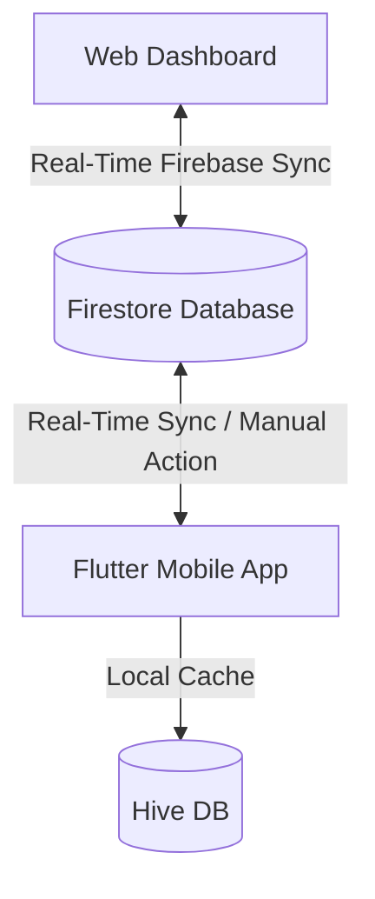

# EasyConnect - Project Context & Architecture Handbook

This handbook provides the core architectural context, data schemas, design systems, and deployment workflows for the **EasyConnect** project. It serves as a source of truth for both developers and agentic AI systems working on the codebase.

---

## 1. System Overview

EasyConnect is a specialized system designed to bridge the digital divide for elderly, non-literate, or low-literacy users. It consists of two primary components:

1. **Flutter Mobile Application**: A face-first, touch-first Android application designed with a single-screen contact grid, Text-to-Speech (TTS) guidance, and simplified SOS emergency triggers.
2. **Web Administration Dashboard**: A web-based admin interface that allows caregivers to manage the contact lists, orderings, and sync configurations remotely.



---

## 2. Active Environments & Deployment

* **Production Web Dashboard**: [https://webdashboard-liart.vercel.app](https://webdashboard-liart.vercel.app)
* **Vercel Project ID**: `prj_yzPQi7rCe7wipR0cdwTa9iFOfErU`
* **Vercel Org ID**: `team_nBIbco78aNwaIb7JDxc1TQMk`
* **Firebase Project ID**: `easyconnect-2599`
* **Local Web Server**: `http://localhost:8000`

---

## 3. Directory Structure & Key Files

### Flutter Mobile App
* [main.dart](file:///c:/Users/heysa/Documents/Dev/EasyConnect/lib/main.dart): App initialization, Hive local storage setups, and Provider scopes.
* [firebase_sync_service.dart](file:///c:/Users/heysa/Documents/Dev/EasyConnect/lib/services/firebase_sync_service.dart): Implements live Firestore streaming and manual download/upload/wipe sync logic.
* [app_settings_screen.dart](file:///c:/Users/heysa/Documents/Dev/EasyConnect/lib/features/settings/screens/app_settings_screen.dart): Administrator control panel on mobile, including sync action buttons and layout fix widgets.
* [contact_repository.dart](file:///c:/Users/heysa/Documents/Dev/EasyConnect/lib/features/contacts/repositories/contact_repository.dart): Abstracted CRUD operations between local Hive database and the app logic.
* [tts_service.dart](file:///c:/Users/heysa/Documents/Dev/EasyConnect/lib/services/tts_service.dart): Voice prompt synthesis controller.

### Web Dashboard
* [index.html](file:///c:/Users/heysa/Documents/Dev/EasyConnect/web_dashboard/index.html): Responsive single-page dashboard containing styling, layout grid, Firestore real-time client SDK integration, and custom Promise-based confirmation dialogs.
* [config.js](file:///c:/Users/heysa/Documents/Dev/EasyConnect/web_dashboard/config.js): Stores public Firebase config credentials.
* [.vercel/project.json](file:///c:/Users/heysa/Documents/Dev/EasyConnect/web_dashboard/.vercel/project.json): Links the web directory to Vercel production hosting.

---

## 4. Data Model & Synchronization Schema

### Firestore Collection
All documents are scoped under a shared family identifier:
`/families/{familyCode}/contacts/{contactId}`

### Contact Schema
Each contact document in Firestore uses the following fields:

| Field Name | Type | Description |
| :--- | :--- | :--- |
| `id` | String | Unique UUID / document identifier. |
| `name` | String | Display name of the contact (required). |
| `phone` | String | Regular voice call phone number (required). |
| `whatsapp` | String | WhatsApp number; if omitted, video call/voice msg actions hide (optional). |
| `photoBase64` | String | Base64-encoded cropped image data. Scaled to <15KB to fit storage-free Firebase Spark limits (optional). |
| `order` | Integer | Positional sort index preserving spatial memory grid layout. |
| `updatedAt` | Integer | Epoch timestamp representing the last modification time. |

### Two-Way Synchronization Mechanics
1. **Real-time Live Sync**:
   * Both the Flutter app and Web Dashboard register active snapshot listeners under `/families/{familyCode}/contacts`.
   * Any change made on the Web Dashboard instantly streams down to the phone's local Hive cache.
   * Any change saved via the phone's Admin Mode instantly uploads to Firestore.
2. **Manual Action Controls**:
   * **Upload to Cloud**: Replaces the cloud database contacts with the phone's current local state.
   * **Fetch from Cloud**: Deletes all local phone contacts and replaces them with cloud data.
   * **Wipe Cloud Database**: Destroys all contact documents in Firestore under that family code.

---

## 5. Web UI Design System & Modal Architecture

The Web Dashboard uses a custom, responsive CSS design with custom dialog overlays.

### No Native Alerts
The dashboard replaces native browser `alert()` and `confirm()` blockades with custom HTML modals styled using Tailwind colors.
* **Confirmations (`showCustomConfirm`)**: Displays centered dialog cards with customizable buttons (e.g. Danger warnings use Red bg, default actions use Indigo).
* **Alerts (`showCustomAlert`)**: Displays success checkmarks or warning triangles for error states.

These return async JavaScript `Promises` allowing developers to write clean blockable logic:
```javascript
const confirmWipe = await showCustomConfirm(
  '⚠️ Wipe Cloud Database',
  'This will permanently delete all contacts in the cloud. Continue?',
  true // isWarning flag
);
if (confirmWipe) {
  // Wipe logic
}
```

---

## 6. Common Development Commands

### Web Dashboard
* **Run Local Server**:
  ```powershell
  python -m http.server 8000
  ```
* **Deploy to Production Vercel**:
  ```powershell
  npx vercel deploy --prod
  ```

### Flutter Mobile App
* **Get Dependencies**:
  ```powershell
  puro flutter pub get
  ```
* **Run Code Generators**:
  ```powershell
  puro flutter pub run build_runner build --delete-conflicting-outputs
  ```
* **Run App Analyzer**:
  ```powershell
  puro flutter analyze
  ```
* **Build Release APK & Install on Connected Device**:
  ```powershell
  puro flutter build apk --release
  adb install -r build/app/outputs/flutter-apk/app-release.apk
  ```
