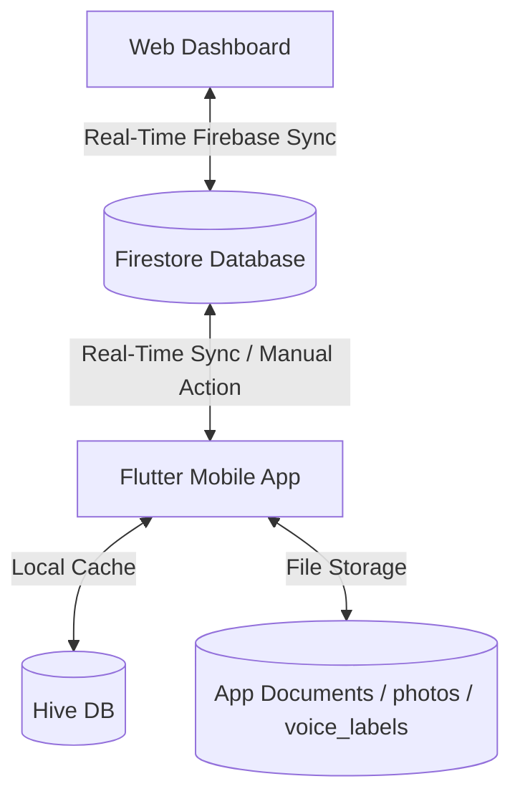

# EasyConnect - Project Context & Architecture Handbook

This handbook provides the core architectural context, database schemas, design systems, and deployment workflows for the **EasyConnect** project. It serves as the single source of truth for both developers and agentic AI systems working on the codebase.

---

## 1. System Overview

EasyConnect is a specialized communication ecosystem designed to bridge the digital divide for elderly, non-literate, or low-literacy users. It enables users to make phone calls, trigger WhatsApp video sessions, and record/send voice messages without reading text, relying entirely on large facial photos, regional language voice synthesis, and distinct haptic/color cues.

The system consists of two primary components:
1. **Flutter Mobile Application**: A face-first, touch-first Android application that can act as the device's Default Dialer, providing custom full-screen call management overlays, regional TTS guidance, and simplified SOS emergency triggers.
2. **Web Administration Dashboard**: A web-based single-page application that allows caregivers (family admins) to manage contacts, customize settings, and reorder grid displays remotely.



---

## 2. Active Environments & Deployment

* **Production Web Dashboard**: [https://webdashboard-liart.vercel.app](https://webdashboard-liart.vercel.app)
* **Vercel Project ID**: `prj_yzPQi7rCe7wipR0cdwTa9iFOfErU`
* **Vercel Org ID**: `team_nBIbco78aNwaIb7JDxc1TQMk`
* **Firebase Project ID**: `easyconnect-2599`
* **Local Web Server**: `http://localhost:8000`

---

## 3. Directory Structure & Key Files

### Flutter Mobile App
* [main.dart](file:///c:/Users/heysa/Documents/Dev/EasyConnect/lib/main.dart): Entrypoint initializing Hive storage adapters, starting background services (e.g. system calls, firebase sync), and launching the root `MaterialApp` wrapped in [SystemCallOverlayWrapper](file:///c:/Users/heysa/Documents/Dev/EasyConnect/lib/main.dart#L188) to intercept call states.
* [home_screen.dart](file:///c:/Users/heysa/Documents/Dev/EasyConnect/lib/screens/home_screen.dart): The main interface featuring the Contact Grid, a simplified Dialing Keypad, Call Log history, connectivity alerts, overlay permission warnings, and device telemetry metrics (battery, signal, voice guide status).
* [firebase_sync_service.dart](file:///c:/Users/heysa/Documents/Dev/EasyConnect/lib/services/firebase_sync_service.dart): Manages real-time Firestore database synchronization, base64 assets decoding/encoding offloaded to compute isolates, and manual cloud upload/wipe actions.
* [system_status_service.dart](file:///c:/Users/heysa/Documents/Dev/EasyConnect/lib/services/system_status_service.dart): Monitors device battery level, power connection state, signal strength, and SIM card health to announce regional status updates via TTS.
* [app_settings_screen.dart](file:///c:/Users/heysa/Documents/Dev/EasyConnect/lib/features/settings/screens/app_settings_screen.dart): Multi-tab administrative panel (Preferences, Emergency SOS, Backup & Info) for bulk CSV import/validation, local ZIP backup, and system integrations.
* [contact_repository.dart](file:///c:/Users/heysa/Documents/Dev/EasyConnect/lib/features/contacts/repositories/contact_repository.dart): CRUD layer abstracts local Hive caching, self-healing color migrations, and filesystem storage for local face JPEG crops and custom recorded voice prompts.
* [tts_service.dart](file:///c:/Users/heysa/Documents/Dev/EasyConnect/lib/services/tts_service.dart): Synthesizes voice guidelines. Includes Telugu/Hindi static phrase translations and a hybrid fallback cache for online neural voice generation.
* [backup_service.dart](file:///c:/Users/heysa/Documents/Dev/EasyConnect/lib/services/backup_service.dart): Bundles settings, contacts, local photos, and audio files into path-independent ZIP archives for device-to-device recovery.
* [csv_service.dart](file:///c:/Users/heysa/Documents/Dev/EasyConnect/lib/services/csv_service.dart): Handles importing, parsing, and verifying CSV spreadsheets and exporting JSON templates.

### Web Dashboard
* [index.html](file:///c:/Users/heysa/Documents/Dev/EasyConnect/web_dashboard/index.html): Responsive single-page admin dashboard featuring CSS glassmorphism, real-time Firestore database SDK clients, and custom Promise-based confirmation/alert modals.
* [config.js](file:///c:/Users/heysa/Documents/Dev/EasyConnect/web_dashboard/config.js): Contains public client credentials for Firebase configuration.

---

## 4. Subsystems & Technical Mechanics

### 4.1 Native Dialer Integration & Call Handler
EasyConnect overrides standard incoming/outgoing call interfaces on Android:
* **Default Dialer Registration**: Utilizes Android MethodChannels to request dialer privileges, allowing [SystemCallService](file:///c:/Users/heysa/Documents/Dev/EasyConnect/lib/features/calling/services/system_call_service.dart#L73) to listen to raw telephony events.
* **Incoming Call Screen Overlay**: Instead of pushing a page via standard Navigator routes (which introduces latency), the [SystemCallOverlayWrapper](file:///c:/Users/heysa/Documents/Dev/EasyConnect/lib/main.dart#L188) overlays a zero-delay `IncomingCallScreen` using a `Stack` block at the root of the app tree.
* **Keep-Alive Ping**: Runs a periodic 25-second no-op background ping on Dart's isolate to prevent Android from pausing the virtual machine during idle periods, guaranteeing instantaneous execution when calls arrive.
* **Caller Name Resolution**: Outgoing and incoming telephone numbers are cleaned of non-digits and dynamically cross-referenced against cached Hive contacts.

### 4.2 Regional Translation & Hybrid TTS Engine
The [TTSService](file:///c:/Users/heysa/Documents/Dev/EasyConnect/lib/services/tts_service.dart#L355) manages regional voice guidance in Telugu (`te`), Hindi (`hi`), and English (`en`):
* **Regional Dictionaries**: [TeluguPhrases](file:///c:/Users/heysa/Documents/Dev/EasyConnect/lib/services/tts_service.dart#L11) and [HindiPhrases](file:///c:/Users/heysa/Documents/Dev/EasyConnect/lib/services/tts_service.dart#L213) translate call statuses, battery warnings, network drops, dialer actions, and error warnings.
* **Hybrid TTS Delivery**:
  * **Online Mode**: Tries to download high-fidelity neural audio MP3s from Google Translate online synthesizers (e.g. for contact names) and caches them in the local `tts_cache/` directory to make subsequent playback instant and offline-capable.
  * **Offline Mode (Fallback)**: Automatically uses Android's native system TTS engine when offline or when using standard static phrases.
* **Voice Customization**: Specifically requests high-fidelity network-based Telugu (`te-IN`) voices if available on the device.

### 4.3 Device Telemetry & SIM Status Checks
The [SystemStatusNotifier](file:///c:/Users/heysa/Documents/Dev/EasyConnect/lib/services/system_status_service.dart#L22) queries Android status APIs every 30 seconds:
* **SIM Card Warnings**: Spoken TTS alerts are triggered instantly if the SIM state changes (e.g., card absent, locked by PIN/PUK, broken hardware, or disconnected).
* **Battery Warning Thresholds**: Announces localized low battery warnings at critical milestones: **20%**, **10%**, and **5%** (each with increasing haptic vibration intensity).
* **Call Interrupt Prevention**: Low battery warnings are queued if a call is currently active or if the calling screen is visible, firing only after the conversation terminates.
* **Power Connection**: Speaks a "charging started" prompt when plugged in, but silences it during initial app startup to avoid noisy boot behaviors.

### 4.4 Emergency SOS & GPS Dispatcher
Tapping the SOS triggers a comprehensive dispatch system:
* **3-Second Countdown**: Displays a full-screen prompt counting down `3... 2... 1...` audibly. Tapping anywhere outside the countdown cancels the action.
* **Call Auto-Rejection**: Silently rejects and hangs up any incoming calls during the countdown period to prevent interruption.
* **Emergency Dialing**: Uses direct telephony intents (`CALL_PHONE` permission) to dial the configured primary contact.
* **GPS Location Alerts**: If location permissions (`geolocator`) are granted, it queries live GPS coordinates and dispatches background SMS alerts (`SEND_SMS` permission) containing Google Maps links to up to two distinct fallback contacts.

---

## 5. Data Model & Synchronization Schema

### Firestore Collection Layout
All documents are scoped under family identifier collections:
`/families/{familyCode}/contacts/{contactId}`

### Contact Schema
Each document in Firestore contains the following fields:

| Field Name | Type | Description |
| :--- | :--- | :--- |
| `id` | String | Unique UUID v4 / document identifier. |
| `name` | String | Display name of the contact (required, max 30 chars). |
| `phoneNumber` | String | Regular voice call phone number (required, format validated). |
| `whatsappNumber` | String | WhatsApp number; if omitted, video call/voice msg actions are disabled (optional). |
| `photoUrl` | String | Base64 data URI (containing `<15KB` image) or remote Firebase Storage URL. |
| `voiceLabelUrl` | String | Base64 data URI (containing custom audio prompt) or remote Firebase Storage URL. |
| `colorTheme` | String | Hex color code utilized for border identification in the contact grid. |
| `preferredAction` | String | Default action on contact card tap: `'call' \| 'video' \| 'message'`. |
| `positionIndex` | Integer | Sort index preserving the user's spatial memory grid. |
| `lastUpdated` | Timestamp | Firestore server timestamp representing the last modification time. |

### Firestore Security Rules ([firestore.rules](file:///c:/Users/heysa/Documents/Dev/EasyConnect/firestore.rules))
The Firestore backend enforces constraints to prevent injection and protect limits:
* **Family Code validation**: Code must be 8-40 characters, containing only alphanumeric characters, underscores, and dashes (`^[a-z0-9_\-]+$`).
* **Contact field validation**: Restricts names to $\le 30$ characters, forces phone numbers to match digit regexes, and whitelists preferred action values.
* **Payload size limits**: Restricts both `photoUrl` and `voiceLabelUrl` string sizes to **<350KB** (358,400 bytes). This prevents Base64 uploads from exceeding Firestore's 1MB document storage limit.

### Local Database caching (Hive)
Local data models match the schema above:
* [Contact](file:///c:/Users/heysa/Documents/Dev/EasyConnect/lib/features/contacts/models/contact_model.dart) (Type ID: 0)
* [AppSettings](file:///c:/Users/heysa/Documents/Dev/EasyConnect/lib/features/settings/models/app_settings_model.dart) (Type ID: 1)
* [CallLog](file:///c:/Users/heysa/Documents/Dev/EasyConnect/lib/features/calling/models/call_log_model.dart) (Type ID: 2)

---

## 6. Backup, Recovery & Self-Healing

### Local ZIP Archive Service
Caregivers can back up the device configurations using [BackupService](file:///c:/Users/heysa/Documents/Dev/EasyConnect/lib/services/backup_service.dart):
* **ZIP Archive Packaging**: Combines settings JSON, contact listings metadata, local photo files, and custom voice prompts into a single archive (`easyconnect_backup_*.zip`).
* **Relative Path Mapping**: Replaces local absolute directory prefixes (which vary by device) with relative references (`photos/` and `voice_labels/`) inside the ZIP, ensuring path-independent restoration on any destination phone.
* **Temp Cache Maintenance**: Automatically purges old zip cache logs in the temporary folder before generation to prevent device storage bloat.

### Self-Healing Color Migrations
To prevent grid visual bugs:
* **Legacy Color Healing**: On startup, a self-healing script scans contacts. Any contact using the deprecated `#4CAF50` fallback color is dynamically assigned a unique color.
* **Visual Collision Prevention**: Colors are picked from a curated palette of vibrant high-contrast colors. If all palette items are occupied, a mathematically distinct color is generated using HSL golden ratio distribution to avoid visual duplicates.

---

## 7. Web UI Design System & Modal Architecture

The Web Dashboard uses custom Tailwind CSS modules and responsive grid systems:
* **Glassmorphism Design**: Incorporates responsive glass panels (`backdrop-filter`) for headers and forms.
* **No Browser Blockers**: Native browser `alert()` and `confirm()` blockades are replaced with custom HTML modal blocks that return JavaScript `Promises`. This allows writing clean, asynchronous blockable controller logic:
  ```javascript
  const proceed = await showCustomConfirm(
    '⚠️ Wipe Cloud Database',
    'This will permanently delete all contacts in the cloud. Continue?',
    true // isWarning styling
  );
  if (proceed) {
    // Execute Firestore collection wipe
  }
  ```
* **Position Reordering**: Administrative reordering triggers write directly to Firestore `positionIndex` fields. The changes immediately propagate to the phone's Hive database via real-time listeners.

---

## 8. Common Development Commands

### Web Dashboard
* **Run Local Server**:
  ```powershell
  python -m http.server 8000
  ```
* **Deploy to Production Vercel**:
  ```powershell
  npx vercel deploy --prod
  ```

### Flutter Mobile App
* **Get Dependencies**:
  ```powershell
  puro flutter pub get
  ```
* **Run Code Generators**:
  ```powershell
  puro flutter pub run build_runner build --delete-conflicting-outputs
  ```
* **Run App Analyzer**:
  ```powershell
  puro flutter analyze
  ```
* **Build Release APK & Install on Connected Device**:
  ```powershell
  puro flutter build apk --release
  adb install -r build/app/outputs/flutter-apk/app-release.apk
  ```

---
*End of Handbook*
